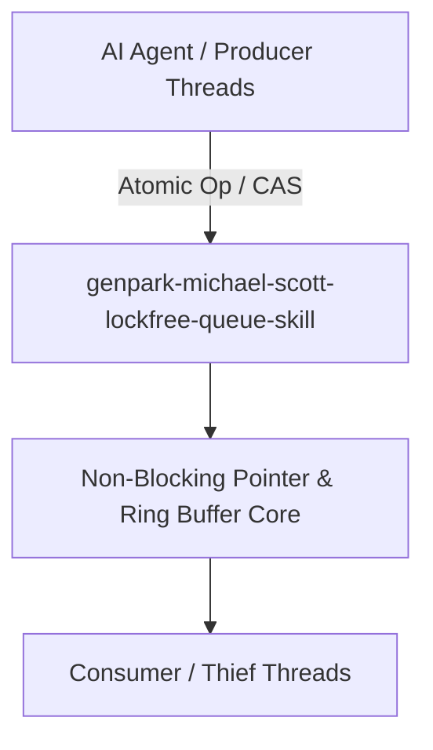

# genpark-michael-scott-lockfree-queue-skill

[](https://github.com/alphaparkinc/genpark-michael-scott-lockfree-queue-skill/actions)
[](https://opensource.org/licenses/MIT)
[](https://www.python.org/downloads/)

> Michael-Scott non-blocking lock-free concurrent FIFO queue using atomic pointer comparisons and safe multi-threaded enqueue/dequeue transitions.

## Architecture



## Features
- Pure standard library Python implementation with strictly zero pip dependencies.
- True non-blocking algorithms preventing priority inversion, deadlocks, and lock contention.
- Native Model Context Protocol (MCP) server support for high-throughput AI agent pipelines.

## Installation

```bash
git clone https://github.com/alphaparkinc/genpark-michael-scott-lockfree-queue-skill.git
cd genpark-michael-scott-lockfree-queue-skill
```

## Quickstart

```bash
python example_usage.py
```
